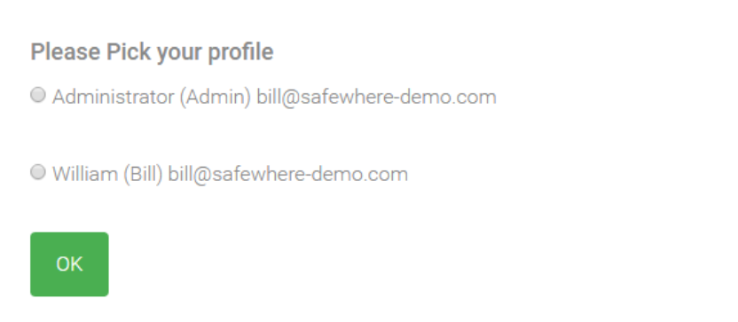

# How to implement an interceptor 

This guideline will get you through the necessary steps to create an interceptor. The use case is:
 - An organization uses Identify as their IdP for their SPs. All users can use an upstream Provider to login which can be a national e-Identity or even Facebook.
 - The organization also has a local user store. In reality, this could be AD or a legacy SQL user store.
 - One user may have multiple profiles in the local store. For example, a user may have an Administrator profile, and a normal user profile. 
 - When a user, whose name is Bill, accesses an SP, he is redirected to Identify and is then redirected to the upstream Identity Provider to perform login. 
 - What we need to achieve here is interesting and useful: after receiving a token from the IdP, Identify will use the email address returning in the token to look up for all Bill's profiles in the local storage. All the found profiles will be shown to Bill so that he can decide what profile he really wants to login as. 

## Implementing an interceptor 

In order to develop an interceptor, you need to create a new C# library project and add reference to Safewhere.External.dll. You can find the dll in the [C:\Program Files\Safewhere\Identify\Tenants\[your Identify instance name]\runtime\bin] folder.

- Step 1: Implement IProtocolInterceptorService interface 

```cs
    /// <summary> 
    /// The demo user profile selector interceptor service. 
    /// </summary> 
    /// <seealso cref="Safewhere.External.Interceptors.IProtocolInterceptorService" /> 
    [ExternalTypeMetadataAttribute("Interactive profiles selection for service providers")] 
    [PrimaryServiceType(typeof(IProtocolInterceptorService))] 
    public class DemoUserProfileSelectorInterceptorService : IProtocolInterceptorService 
    { 
        /// <summary> 
        ///  The dependency service to get the information of user profiles. 
        /// </summary> 
        private readonly IUserProfileService userProfileService; 
  
        /// <summary> 
        /// The IUserProfileService service expects a component implemented by a client, configured on Admin UI or a windsor config file 
        /// </summary> 
        /// <param name="userProfileService"></param> 
        public DemoUserProfileSelectorInterceptorService(IUserProfileService userProfileService) 
        { 
            if (userProfileService == null) 
            { 
                throw new ArgumentNullException("userProfileService"); 
            } 
  
            this.userProfileService = userProfileService; 
        } 
  
        /// <summary> 
        /// Intercepts an login flow on the protocol side. 
        /// </summary> 
        /// <param name="cc">The controllercontext object of the current request</param> 
        /// <param name="principal">A claims principal which Identify receives from an upstream Identity Provider</param> 
        /// <param name="input">Static settings which are configured on the protocol connection UI. Each specific implementation requires different static settings. 
        /// For example, an interceptor which needs to access a database will need a connection string, while one which needs to access an AD store will need to know where the AD server is</param> 
        /// <param name="contextId">Each login a user does with Identify will have a context id.</param> 
        /// <param name="viewName">Name of the main view which an interceptor may want to display to a user. 
        /// Interceptors which want to have more than one configurable views can use the input parameter instead.</param> 
        /// <returns> 
        /// A null value means that this interceptor has done its job and doesn't want to intercept the login flow. 
        /// </returns> 
        /// <remarks> 
        /// When an authentication or a protocol connection is configured to use an interceptor, Identify will call this method of the interceptor. 
        /// This is the chance for the interceptor to do whatever it wants to do before Identify takes control back and proceeds to the next step. 
        /// </remarks> 
        public ActionResult Intercept(ControllerContext cc, ClaimsPrincipal principal, IDictionary<string, string> input, 
                                  string contextId, 
                                  string viewName) 
        { 
            // validate input parameters 
            #region sanity checks 
            if (cc == null) 
            { 
                throw new ArgumentNullException("cc"); 
            } 
            if (principal == null) 
            { 
                throw new ArgumentNullException("principal"); 
            } 
            if (input == null) 
            { 
                throw new ArgumentNullException("input"); 
            } 
            #endregion 
  
            // get profile list for user 
            List<UserProfile> userProfiles = 
                    userProfileService.GetUserProfiles(cc, principal, input, contextId).ToList(); 
    
            // check profile list result 
            if (userProfiles.Count == 0) 
            { 
                return null; 
            } 
    
            if (userProfiles.Count == 1 && !userProfileService.ShowUserProfileSelectorWhenUserHasASingleProfile) 
            { 
                return null; 
            } 
    
            // specify the view name 
            if (string.IsNullOrEmpty(viewName)) 
            { 
                    viewName = "DemoProfileSelectionList"; 
            } 
    
            // create the view result 
            var viewResult = new ViewResult 
                                { 
                                    ViewName = viewName, 
                                    ViewData = 
                                        { 
                                                Model = 
                                                    new DemoProfileListModel 
                                                        { 
                                                            ContextId = contextId, 
                                                            UserProfiles = userProfiles 
                                                    } 
                                        } 
                                }; 
    
            return viewResult; 
        } 
  
        /// <summary> 
        /// In the event of the login flow was intercepted and a UI is shown to a user, this method is called to handle data which the user submits. 
        /// </summary> 
        /// <param name="cc">The controllercontext object of the current request</param> 
        /// <param name="principal">A claims principal which Identify receives from an upstream Identity Provider</param> 
        /// <param name="input">Static settings which are configured on the protocol  connection UI. Each specific implementation requires different static settings. 
        /// For example, an interceptor which needs to access a database will need a connection string, while one which needs to access an AD store will need to know where the AD server is</param> 
        /// <param name="contextId">Each login a user does with Identify will have a context id.</param> 
        /// <param name="viewName">Name of the main view which an interceptor may want to display to a user. 
        /// Interceptors which want to have more than one configurable views can use the input parameter instead.</param> 
        /// <returns> 
        /// A null value means that this interceptor has done whatever it wants to based on data submitted from the user and the login flow should proceed. 
        /// Otherwise, return an ActionResult to continue to intercept the login flow. 
        /// </returns> 
        public ActionResult OnPostBack(ControllerContext cc, ClaimsPrincipal principal, 
                                    IDictionary<string, string> input, string contextId, 
                                    string viewName) 
        { 
            // validate input parameters 
            if (cc == null) 
            { 
                throw new ArgumentNullException("cc"); 
            } 
            if (principal == null) 
            { 
                throw new ArgumentNullException("principal"); 
            } 
            if (input == null) 
            { 
                throw new ArgumentNullException("input"); 
            } 
    
            string selectedIdentity = cc.HttpContext.Request.Params["__selectedIdentity"]; 
            if (string.IsNullOrEmpty(selectedIdentity)) 
            { 
                return Intercept(cc, principal, input, contextId, viewName); 
            } 
    
            List<UserProfile> userProfiles = 
                    userProfileService.GetUserProfiles(cc, principal, input, contextId).ToList(); 
    
            var selectedUserProfile = userProfiles.FirstOrDefault(profile => profile.Identity == selectedIdentity); 
            if (selectedUserProfile == null) 
            { 
                // ask user to select again 
                return Intercept(cc, principal, input, contextId, viewName); 
            } 
            // transforms ClaimsPrincipal based on the selected user profile 
            userProfileService.Transform(cc, principal, input, contextId, selectedUserProfile); 
            return null; 
            } 
    
            /// <summary> 
            /// Defines a list of must-have static settings which system administrator must be configured for this interceptor on the protocol connection UI. 
            /// This attribute is not in use in Identify 4.1 yet. 
            /// </summary> 
            public IEnumerable<string> MustHaveInputKeys 
            { 
                get { return userProfileService.MustHaveInputKeys; } 
        } 
    }
```

 - Step2 (Optional): Implement IUserProfileService interface to process business logic layer.  
This service will be registered as an Interceptor’s dependency. 
Using the attribute [InterceptorDependencyService] to specify this service is an Interceptor’s dependency. 

```cs
    /// <summary> 
    /// A dummy user profile service implementation of IUserProfileService which is used by the "interactively select user profiles" feature of Identify. 
    /// </summary> 
    /// <remarks> 
    /// InterceptorDependencyService attribute tells Identify that this is a dependency of the user profiles selection service. 
    /// Here we don't use PrimaryBaseType. In this case, Identify will try to find the first interface, and then the first abstract class, which this component implements. 
    /// ExternalTypeMetadata attribute tells Identify that friendly name of this service is "Dummy look up user profiles" 
    /// </remarks> 
    [InterceptorDependencyService] 
    [ExternalTypeMetadata("Dummy look up user profiles")] 
    public class DummyUserProfileService : IUserProfileService 
    { 
        private readonly IIdentifyLogWriter logWriter; 
  
        /// <summary> 
        /// This sample has dependency to IIdentifyLogWriter. Their implementation are provided by Identify. 
        /// </summary> 
        /// <param name="logWriter">A logger</param> 
        public DummyUserProfileService( IIdentifyLogWriter logWriter) 
        { 
        if (logWriter == null) 
        { 
            throw new ArgumentNullException("logWriter"); 
        } 
  
            this.logWriter = logWriter; 
        } 
  
        /// <summary> 
        /// Looks up user profiles from a store based on data passed from the caller interceptor. 
        /// </summary> 
        /// <param name="cc">The controllercontext object of the current request</param> 
        /// <param name="principal">A claims principal</param> 
        /// <param name="input">Passed from the interceptor.</param> 
        /// <param name="contextId">Each login a user does with Identify will have a context id.</param> 
        /// <returns> 
        /// All the matched user accounts. 
        /// It is perfectly fine to return a subclass of UserProfile to add more user's attributes. Doing this means that you will also need to customize the view file to 
        /// reflect newly added fields. 
        /// </returns> 
        public IEnumerable<UserProfile> GetUserProfiles(ControllerContext cc, ClaimsPrincipal principal,                                   IDictionary<string, string> input, string contextId) 
        { 
            #region sanity checks 
            if (cc == null) 
            { 
                throw new ArgumentNullException("cc"); 
            } 
            if (principal == null) 
            { 
                throw new ArgumentNullException("principal"); 
            } 
            if (input == null) 
            { 
                throw new ArgumentNullException("input"); 
            } 
            if (contextId == null) 
            { 
                throw new ArgumentNullException("contextId"); 
            } 
            #endregion 

            // get profile list  
            // in reality, we need to query from other storage to get list of profiles base on the input condition. 
            List<UserProfile> userProfiles = new List<UserProfile>(); 

            var userProfile1 = new UserProfile(); 
            userProfile1.Identity = "Admin"; 
            userProfile1.DisplayName = "Administrator"; 
            userProfile1.Email = "bill@safewhere-demo.com"; 
            userProfile1.PhotoUrl = "admin.png"; 
            userProfiles.Add(userProfile1); 

            var userProfile2 = new UserProfile(); 
            userProfile2.Identity = "Bill"; 
            userProfile2.DisplayName = "William"; 
            userProfile2.Email = "bill@safewhere-demo.com"; 
            userProfile2.PhotoUrl = "user.png"; 
            userProfiles.Add(userProfile2); 

            return userProfiles; 
        } 
    
        /// <summary> 
        /// Some claim type may have multiple values 
        /// </summary> 
        /// <param name="claimValue"></param> 
        /// <returns></returns> 
        private string GetClaimValue(object claimValue) 
        { 
            if (claimValue == null) 
                return string.Empty; 
    
            var multiValues = claimValue as IEnumerable<string>; 
            if (multiValues != null) 
            { 
                return string.Join(",", multiValues); 
            } 
    
            return claimValue.ToString(); 
            } 
    
            /// <summary> 
            /// Transforms ClaimsPrincipal based on the selected user profile. 
            /// </summary> 
            /// <param name="cc">The controllercontext object of the current request</param> 
            /// <param name="principal">A claims principal</param> 
            /// <param name="input">Passed from the interceptor.</param> 
            /// <param name="contextId">Each login a user does with Identify will have a context id.</param> 
            /// <param name="selectedUserProfile">The selected user profile.</param> 
            public void Transform(ControllerContext cc, ClaimsPrincipal principal, IDictionary<string, string> input, string contextId, 
                            UserProfile selectedUserProfile) 
            { 
            // this sample replaces the old identity with one picked from the selected profile 
            ClaimsIdentity identity = ((ClaimsIdentity)principal.Identity); 
            Claim nameClaim = identity.FindFirst(identity.NameClaimType); 
            string nameClaimType = identity.NameClaimType; 
            identity.RemoveClaim(nameClaim); 
            identity.AddClaim(new Claim(nameClaimType, selectedUserProfile.Identity)); 
    
            // so what about the other attributes of the user? Two ways: 
            //  1. Specify all the required attributes to get out on the GetUserProfiles method. Examine selectedUserProfile.Attributes for those attributes and convert them to claims 
            //  2. A better way is to not fetch additional attributes in this step. Instead, use claim transformation rules. Please note that 
            //  if a user exists in local store, UserClaimTransformation rule will be responsible for adding claims from local store. 
        } 
  
        /// <summary> 
        /// Should the caller interceptor shows all the user profiles selector view to a user when there is only one profile found 
        /// </summary> 
        public bool ShowUserProfileSelectorWhenUserHasASingleProfile { get { return false; } } 
  
        /// <summary> 
        /// Defines a list of must-have static settings which system administrator must be configured for this interceptor on the protocol connection UI. 
        /// This attribute is not in use in Identify 4.1 yet. 
        /// </summary> 
        public IEnumerable<string> MustHaveInputKeys { get { return new List<string> { "identityClaimName" }; 
    } 
} 
```

- Step 3: Create View and Model to show the UI for interceptor. Sample view: DemoProfileSelectionList.cshtml 

```cs
@using Safewhere.IdentityProvider.RuntimeModel
@using Safewhere.IdentityProviderModel
@using System.Web.Mvc.Html
@using Safewhere.External.Samples

@section MainContent{ 
  
    <div class="nav-box-50"> 
        <div class="form-top"> 
        <div class="form-top-left text-left"> 
  
            <h4>Please Pick your profile </h4> 
            <form role="form" method="post" class="login-form"> 
                @foreach (var profile in Model.UserProfiles) 
                { 
                    <div class="login-form-select-profile"> 
                            <span> 
                            @Html.RadioButton("identities", @profile.Identity, false, new { onclick = "SetSelectedIdentityToHiddenField();" }) 
                        </span> 
                        <span> 
                                <text>@profile.DisplayName (@profile.Identity)</text> 
                        </span> 
                        <span> 
                            <text>@profile.Email</text> 
                        </span> 
                    </div> 
  
                    <br /> 
  
                } 
  
                <div class="form-group"> 
                    <button type="submit" class="btn">OK</button> 
                </div> 
  
                @Html.Hidden("__selectedIdentity", string.Empty, new { id = "__selectedIdentity" }) 
                @Html.Partial("RenderFormParameters", new RenderFormParametersModel(Model.ContextId))  
            </form> 
  
        </div> 
        </div> 
        <div class="form-bottom"></div> 
    </div> 
} 
```

Model: DemoProfileListModel 
```cs
    /// <summary> 
    /// The demo profile list model. 
    /// </summary> 
    public class DemoProfileListModel 
    { 
        public DemoProfileListModel() 
        { 
        UserProfiles = new List<UserProfile>(); 
        } 
  
        public string ContextId { get; set; } 
        public IEnumerable<UserProfile> UserProfiles { get; set; } 
    } 
 ```
  
  
## Deployment 

1. Build your project and copy out dll with all dependiency dlls to C:\Program Files\Safewhere\Identify\Tenants\[your Identify instance name]\runtime\bin folder 
2. Copy the view file to C:\Program Files\Safewhere\Identify\Tenants\[your Identify instance name]\runtime\Views\PlugIn\ folder 
3. Setting on connection: [to be updated with screenshot from Safewhere Admin]
4. Output: 
